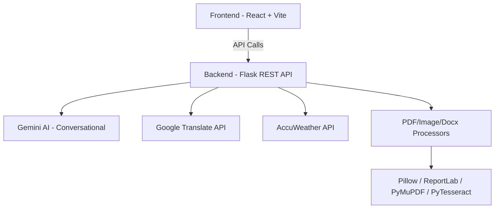

# Mitra AI – Your Gentle AI Greet Companion 🤖💬

Mitra AI (formerly *Gentle AI Greet*) is a modern, full-stack AI assistant web application designed to help users chat intelligently, analyze documents and images, translate text, generate PDFs from images, and more — all wrapped in a sleek, intuitive interface.

---

## 📚 Table of Contents

- [Overview](#overview)
- [Features](#features)
- [Architecture](#architecture)
- [Frontend (React + Vite)](#frontend-react--vite)
- [Backend (Flask)](#backend-flask)
- [Key Components](#key-components)
- [Setup &amp; Installation](#setup--installation)
- [Usage](#usage)
- [Technologies Used](#technologies-used)
- [Deployment &amp; Custom Domain](#deployment--custom-domain)
- [Screenshots &amp; Diagrams](#screenshots--diagrams)
- [License](#license)

---

## 🚀 Overview

Mitra AI is crafted for seamless interactions with AI. Built using Python Flask and React + Vite, it utilizes Google Gemini AI for natural language understanding and integrates a suite of tools for image, document, weather, translation, and media handling.

> The name "Mitra" comes from the Sanskrit word for "Friend", symbolizing the assistant's warm and human-like support.

---

## ✨ Features

- 🤖 **Conversational AI Assistant** (Powered by Google Gemini)
- 📄 **Document Analysis** (PDF, DOCX extraction)
- 🖼️ **Image Keyword Extraction & Search** (AI + Google Images)
- 🖨️ **Image to PDF Conversion** (High-quality output using Pillow & ReportLab)
- 🌍 **Text Translation** (Google Translate API)
- 🌤️ **Weather Info** (AccuWeather API)
- 🕒 **Conversation History Management**
- 🌐 **Multilingual & Gender Customization**
- 🎨 **Modern Responsive UI (Tailwind + shadcn-ui)**

---

## 🧠 Architecture



---

## 🎨 Frontend (React + Vite)

- Entry: `src/App.tsx`
- Modern SPA with modular components
- Tailwind CSS + shadcn-ui for clean and responsive design
- Uses `apiService.ts` for all backend interaction
- Utility-driven: `assistantUtils.ts` for name/gender/greeting logic

### Main Components:

- `AIAssistant.tsx`: Chat interface + tool integrations
- `FileUpload.tsx`: Drag/drop image & document uploader
- `ImageToPdfModal.tsx`: Handles image-to-PDF flow
- `SettingsModal.tsx`, `WeatherModal.tsx`, etc.

---

## 🔧 Backend (Flask)

- Main File: `backend/main.py`
- Environment: Requires `.env` with:
  - `GEMINI_API_KEY`
  - `GOOGLE_TRANSLATE_API_KEY`
  - `ACCUWEATHER_API_KEY`

### Core Endpoints:

| Endpoint           | Functionality                    |
| ------------------ | -------------------------------- |
| `/search`        | AI chat (Gemini integration)     |
| `/search-image`  | Image keyword AI + Google Search |
| `/upload-doc`    | PDF/DOCX analysis                |
| `/images-to-pdf` | Image upload -> High-quality PDF |
| `/translate`     | Translate user input text        |
| `/get-weather`   | Weather info via AccuWeather     |

### Libraries:

- `Flask`, `flask-cors`, `PyMuPDF`, `Pillow`, `PyPDF2`, `pytesseract`, `python-docx`

---

## 🧩 Key Components

| Component               | Responsibility                                              |
| ----------------------- | ----------------------------------------------------------- |
| `AIAssistant.tsx`     | Main assistant logic, tool integration, state management    |
| `FileUpload.tsx`      | File handling, drag-and-drop, previews                      |
| `ImageToPdfModal.tsx` | Select & convert images to PDF                              |
| `apiService.ts`       | Handles all backend calls with error management             |
| `assistantUtils.ts`   | Custom greetings, assistant personalization, helper methods |

---

## ⚙️ Setup & Installation

### Prerequisites

- **Node.js** & npm (for frontend)
- **Python 3.8+** (for backend)
- Create `.env` in `backend/` with required API keys

### 🔁 Backend Setup

```bash
cd backend
python -m venv venv
source venv/bin/activate  # or venv\Scripts\activate on Windows
pip install -r requirements.txt
python main.py
```

### 💻 Frontend Setup

```bash
cd frontend
npm install
npm run dev
```

---

## 🔍 Usage

- Start backend and frontend
- Open your browser to `http://localhost:5173`
- Begin chatting with your assistant!
- Upload images/docs, translate text, generate PDFs

---

## 🛠️ Technologies Used

| Stack Layer         | Tech                                         |
| ------------------- | -------------------------------------------- |
| Frontend            | React, TypeScript, Vite, Tailwind, shadcn-ui |
| Backend             | Python, Flask, flask-cors                    |
| AI & NLP            | Gemini API (Google Generative AI)            |
| Image/PDF           | Pillow, ReportLab, PyMuPDF, pytesseract      |
| Weather & Translate | AccuWeather API, Google Translate            |

---

## ☁️ Deployment & Custom Domain

You can deploy Mitra AI using:

### Frontend:

- Vercel, Netlify, or GitHub Pages

### Backend:

- Render, Railway, or Heroku

> Custom domains can be configured via your chosen hosting platform's dashboard. Ensure API URL paths are correctly set for production.

---

## 🖼️ Screenshots & Diagrams

### Logo


### Architecture Diagram

 `<!-- You can generate and upload this -->`

### UI Preview


---

## 📄 License

This project is open-source and licensed under the [MIT License](LICENSE).

---

## 🙌 Contribute

Have ideas to improve Mitra AI? PRs and Issues are welcome!

```bash
# Fork and clone the repo
# Create a new branch
# Make your changes
# Submit a pull request 🚀
```

> Made with ❤️ by [Your Name] – bringing AI a little closer to home.
